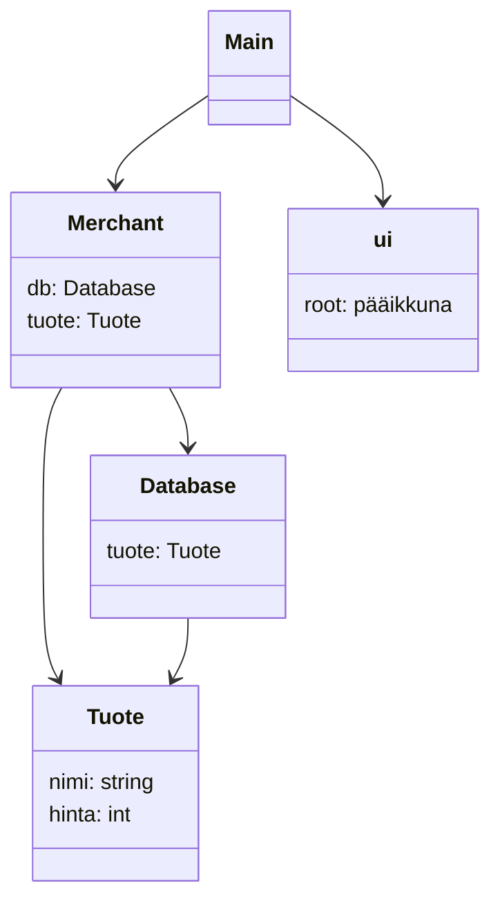
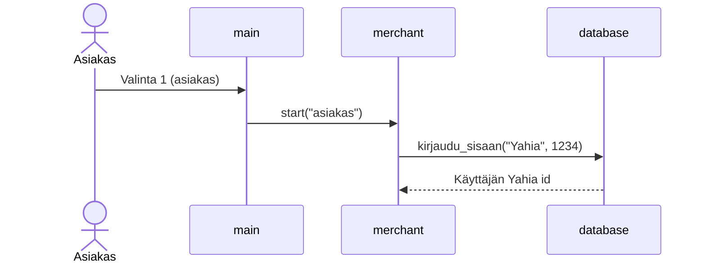

# Arkkitehtuurikuvaus
## Rakenne

## Sovelluslogiikka

## Käyttäjän sisäänkirjautuminen

## Verkkokaupan datan pysyväistallennus
Verkkokaupan datan pysyväistallennuksesta huolehtii luokat merchant.py ja tieokanta backend.db.

Pysyväistallennuksessa on käytetty SQL-tietokantaa
