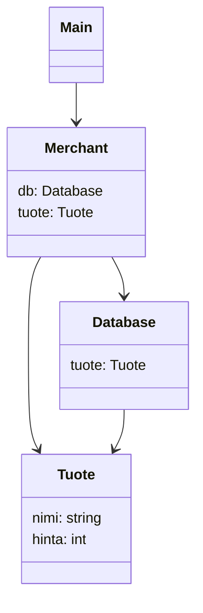
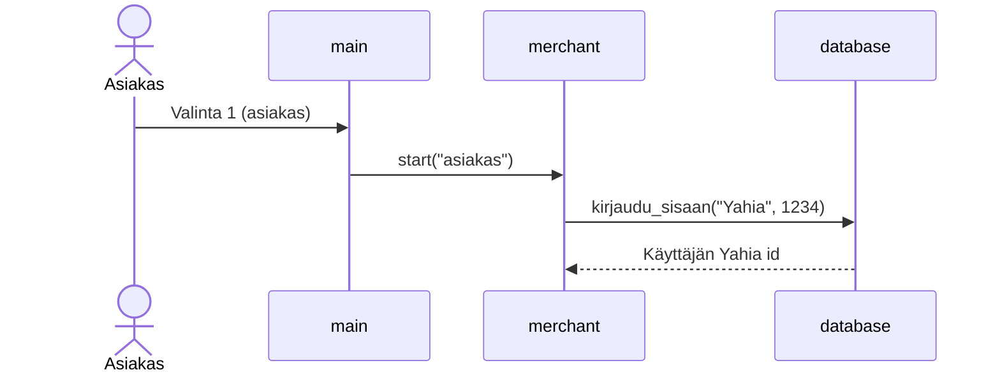

## Rakenne

```mermaid
 classDiagram
 
      Main --> Merchant
 
      Merchant --> Database
      Merchant --> Tuote
 
      Database --> Tuote
      
      class Main{
      
      }
      
      class Merchant{
      db: Database
      tuote: Tuote
      }
      
      class Database{
      tuote: Tuote
      }
      
      class Tuote {
      nimi: string
      hinta: int
      }  
```

## Käyttäjän sisäänkirjautuminen

```mermaid
sequenceDiagram
  actor Asiakas
  
  participant main
  participant merchant
  participant database
  
  Asiakas ->> main: Valinta 1 (asiakas)
  main ->> merchant: start("asiakas")
  merchant ->> database: kirjaudu_sisaan("Yahia", 1234)
  
  database -->> merchant: Käyttäjän Yahia id
```
