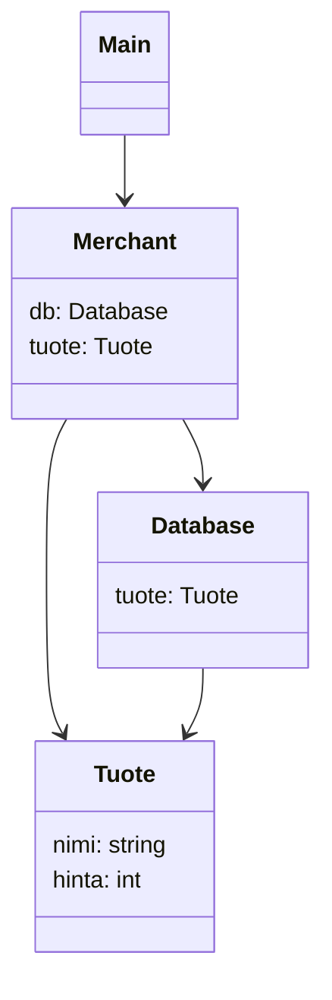

```mermaid
 classDiagram
 
      Main --> Merchant
 
      Merchant --> Database
      Merchant --> Tuote
 
      Database --> Tuote
      
      class Main{
      
      }
      
      class Merchant{
      db: Database
      tuote: Tuote
      }
      
      class Database{
      tuote: Tuote
      }
      
      class Tuote {
      nimi: string
      hinta: int
      }  
```
