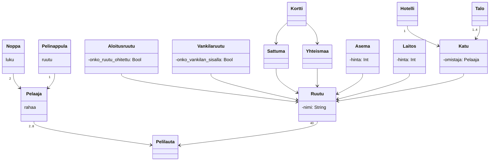

```mermaid
 classDiagram
	
	Noppa "2" --> Pelaaja
	Pelaaja "2..8" --> Pelilauta
	Ruutu "40" --> Pelilauta
	Pelinappula "1" --> Pelaaja

	Aloitusruutu --> Ruutu
	Vankilaruutu --> Ruutu
	Sattuma --> Ruutu
	Yhteismaa --> Ruutu
	Asema --> Ruutu
	Laitos --> Ruutu
	Katu --> Ruutu
	
	Hotelli "1" --> Katu
	Talo "1..4" --> Katu
	
	Kortti --> Sattuma
	Kortti --> Yhteismaa
	

	class Noppa {
		luku
	}

        class Pelaaja {
		rahaa
        }

	class Pelilauta {
	}

	class Ruutu {
		-nimi: String
	}
	
	class Pelinappula {
		ruutu
	}

	class Aloitusruutu {
		-onko_ruutu_ohitettu: Bool
	}

	class Vankilaruutu {
		-onko_vankilan_sisalla: Bool
	}
		
	class Sattuma {
	}	
	
	class Yhteismaa {
	}
	
	class Asema {
		-hinta: Int
	}
	
	class Laitos {
		-hinta: Int
	}

	class Katu {
		-omistaja: Pelaaja
	}
	
	class Hotelli {
	}
	
	class Talo {
	}
	
	class Kortti {
	}
	 
```
